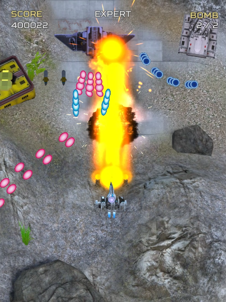
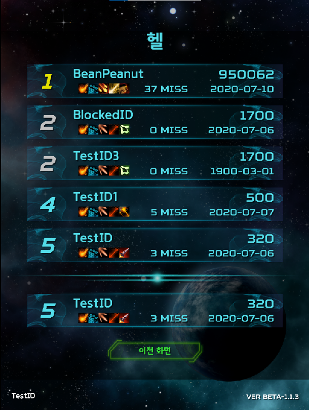
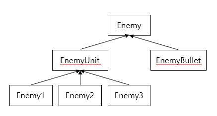

# Dead Planet 2

## 게임 정보

* 게임명 : Dead Planet 2

* 장르 : 탄막 슈팅 게임

* 엔진 : 유니티

* 버전 : ver 1.1.3-Beta

## 개발 정보

* 제작자 : jeff_jks@naver.com

* 제작 시작 : May 7th, 2019 (유니티 학습 기간 포함)

* 유니티 버전 : 2019.1.8f1

## 프로젝트 내용

데드 플래닛 2는 유니티를 사용한 탄막 슈팅 게임입니다.

온라인 랭킹과 간단한 로그인 시스템이 구현되어있으며 로그인을 원하지 않는다면 온라인 랭킹을 사용할 수 없는 대신 오프라인으로도 플레이가 가능합니다.

자주 등장하는 개체에게는 오브젝트 풀링 기법을 적용하고 배경에 대해서는 라이트 베이킹을 통해 그림자 연산량을 줄여 최적화 하였습니다.

또한 오클루전 컬링을 사용하여 카메라 바깥의 개체는 렌더링을 하지 않도록 했습니다.

적의 종류가 많지만 적 개체끼리 공통적인 특성들이 많기 때문에 추상 클래스와 상속을 사용하여 효율적으로 구현하였습니다.

## 사용한 에셋

* 모델링
   * Ballistic Turret
   * Chainlink Fences
   * EnergyShieldEffect
   * Futuristic Aircrafts
   * Free SF Fighter
   * Hyper Falcon Modular Spaceship
   * Low poly combat drone
   * Military Helicopter
   * Modular Space Platform Kit
   * PBR RPG/FPS Game Assets (Industrial Set v1.0)
   * Powerup Crate
   * Rock and Boulders 2
   * RPG/FPS Game Assets for PCbile (Industrial Set v2.0)
   * Scifi RTS Series Mega Pack I
   * Scifi RTS Series Mega Pack II
   * Simple Gems Ultimate Animated Customizable Pack
   * Simple Sci-Fi Turret
   * Spaceship+Fighter+Set of...+
   * Space Missiles
   * Spaceships Fleet III Mega Pack I
   * UXR Tetrahedron (by ENEA LE FONS, Sketchfab)

* 이미지, 텍스쳐
   * 50+ Progress Bars [Pack 4] - DANGEROUS PROGRESS
   * https://www.freepik.com/
   * Sci Fi UI Pack
   * Sci-Fi Skill Icon Pack
   * Sci-Fi Texture Pack

* 이펙트
   * Effect textures and prefabs
   * Quality Explosion SpriteKit
   * Shockwave Effects
   * Waf FX

* 사운드
   * CAVE Interactive CO. LTD (Ketsui)
   * Fantasy Menu SFX

* 지형
   * City Highways Construction Kit
   * City Street Props
   * Grass And Flowers Pack 1
   * Race Tracks
   * Seamless Textures
   * Standard Asset
   * Windridge City
   * World Space Trees (FREE)

* 기타
   * Asset Usage Detector
   * Auto Letterbox
   * DOTween

